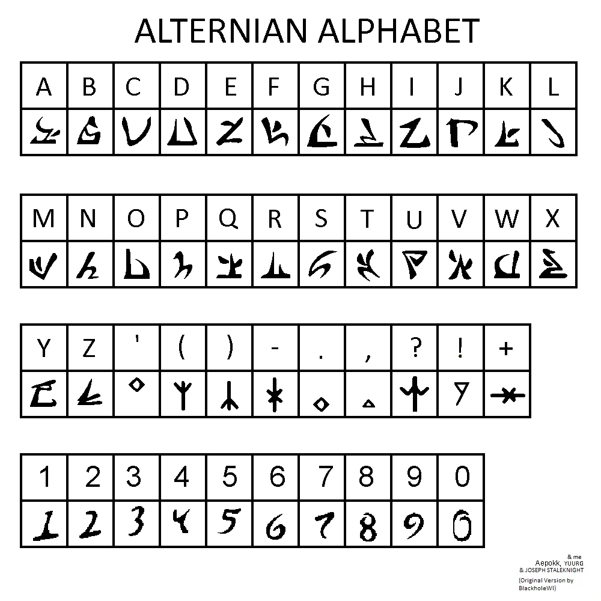

# Core conceit

Alternian teenage culture is diglossic. Alternian is the traditional/formal/native language. The beta trolls' dialect of English (hereby referred to as "Alternian English" is colloquially spoken amongst youth, a la the real world Icelandic/English situation in Iceland. The differences between their dialect of English and real-world English are taken as evidence of substrate influence from Alternian, and the core conceit is that we are doing reconstructive linguistics on Alternian.

# Alternian

TBD: restructure this section once it is ironed out more

## Structure

- Alternian is modifier-before-head, and head-final in compounds.
- SOV word order
- Agglutinative, suffixing morphology
    - Alternian prefers to coin vocabulary by German-esque native compounding rather than borrowing, which makes sense for a xenophobic empire that would not stoop to loaning words from conquered species
    
## Phonology

- Trolls have human-like vocal anatomy, no need to get too crazy with the articulators. Keep the inventory human-speakable.
- TBD: Synthesize evidence and come up with a phonology. Make sure to consider typing quirks as eivdence

## Orthography

The (new, Hiveswap-style) Alternian Alphabet, but not just as the English cipher it's used as in canon. The *romanization* is the same, however:

TBD: I (Robin) can create a font for this that uses Unicode Private Use Areas, or just a font for Latin script? The latter would be easier to type in but the former would be more faithful. Decide on this. Or just do both?

# Evidence

TBD: Thoroughly analyze Homestuck texts for more evidence

## Calques

Alternian English demonstrates several what-are-likely-to-be calques from Alternian, e.g. *thinkpan*, *respiteblock*, *load gaper*, *ablution trap*, *one wheel device*, *husktop*.

This is evidence that Alternian is modifier-before-head, and head-final in compounds.

This would pair nicely with SOV word order and agglutinative, suffixing morphology, so we take that as the case.

## Direct borrowings

Alternian English has some direct borrowings from Alternian: e.g. *matesprit*, *kismesis*, *moirail*, *auspistice*, *lusus*, *kismesissitude*, *moirallegiance*. I think we can also assume that troll proper names (Karkat, Gamzee, etc) are direct borrowings from Alternian.

If these are culturally untranslatable concepts, they probably were borrowed with minimal changes, meaning that these preserve Alternian phonology and morphology.

Visible derivational morphology:
 - kismesis → kismesissitude
 - moirail → moirallegiance
 - matesprit → matespritship, auspistice → auspisticeship
 
Working reconstruction: an abstract-noun / relationship-state suffix, tentatively -(is)itud or similar, meaning "the state/relationship of being X". The English forms are anglicized renderings of this suffix.

## Typing quirks

**Typing quirks do not exist in Alternian**, but they do in Alternian English. This indicates that they are each troll's own idiosyncratic solutions to rendering tone, prosody, or features from Alternian in Alternian English. **They are not in themselves features of Alternian, but are excellent material to help reconstruction.** The real-world model is Arabizi. 

For example, Terezi replacing specifically A/E/I may indicate Alternian vowel qualities English/Latin-ish orthography can't distinguish (e.g., pharyngealized or creaky-voiced vowels).

Sollux quirk could indicate contrastive gemination in Alternian? Idk

Eridan's quirk could mark a phoneme in the /w/~/v/ space preserved in his (seadweller/aristocratic?) dialect?

Gamzee's AlTeRnAtInG cApS is prosodic, not segmental. Does Alternian have tone marking that he is trying to communicate in English?

Compare with real-world Arabizi and individual-user idiosyncrasies.
